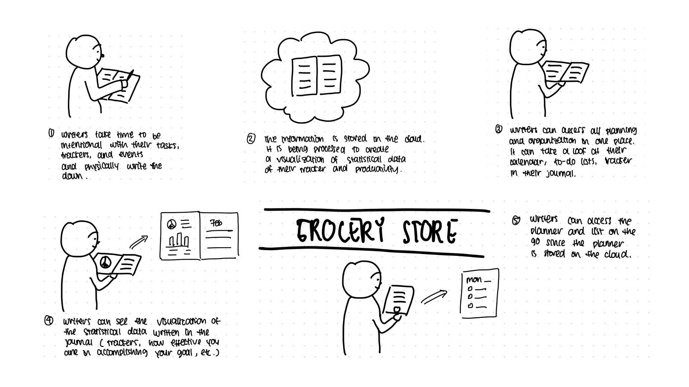
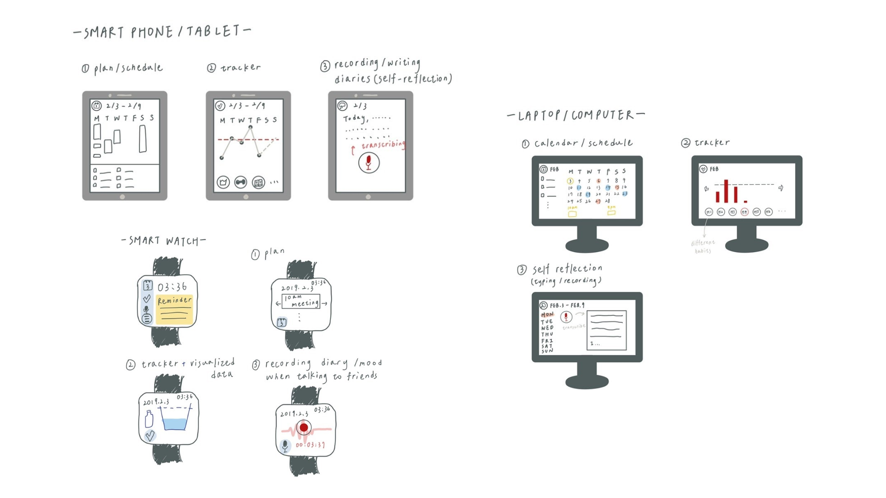
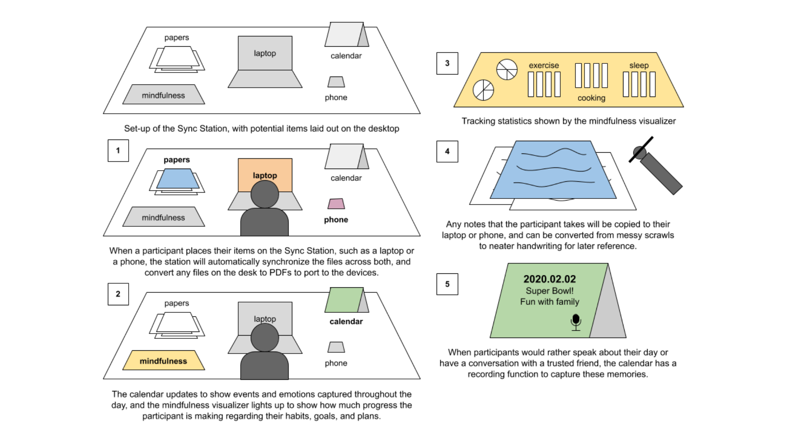
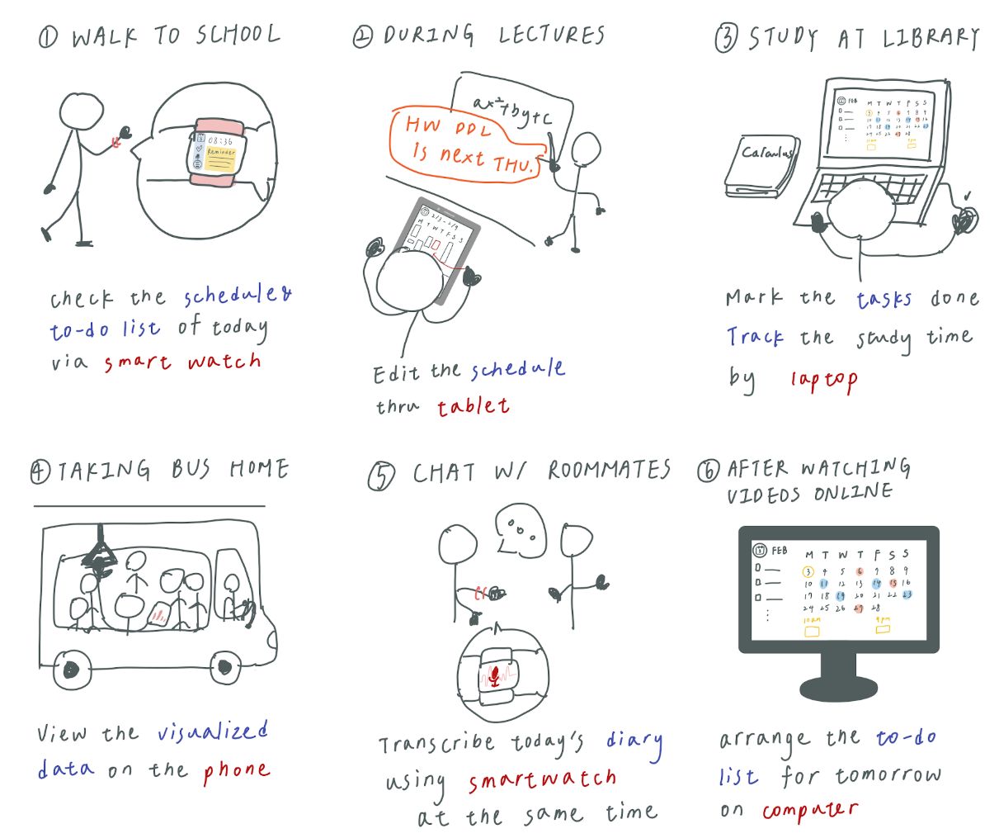
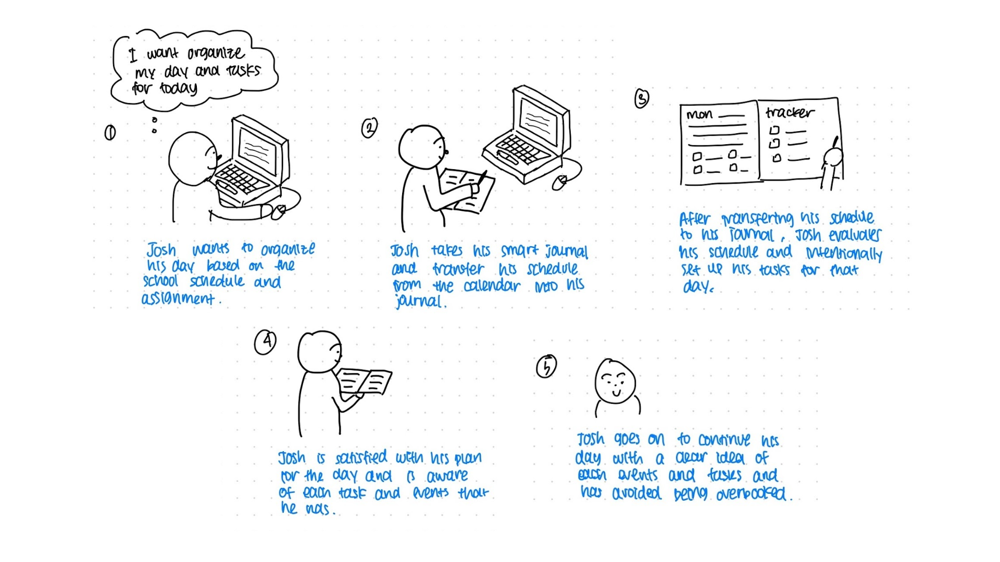

# Pocket Planner 

*Journal anywhere, any way you want* 

by Lucy Jiang, Natasya Juliette, and Chia-Lin Liu

## Problem and Solution Overview
In today’s society, many quantify personal success with awards and achievements instead of happiness and health. Such a mindset causes people to prioritize their work over all else, and many people neglect both their physical and mental health - according to the National Alliance on Mental Illness, “1 in 5 U.S. adults experience mental illness each year” [1]. Bullet journaling is an existing method for people to manage their schedules or thoughts, and focuses on improving efficiency and mindfulness. However, it is inconvenient, time-consuming, and intimidating. It currently exists as a physical form where people can spend hours designing their journal spreads, only to abandon them after infrequent use. The online journaling community can also be intimidating for those with limited art experience, as many journalists use social media to share their extravagant spreads.

Our proposed solution, Pocket Planner, transforms bullet journaling into a hybrid digital and physical experience with a smart journal and an app. This maintains the same efficiency as bullet journaling but removes the restriction of a paper journal, making it portable and convenient. By providing people with semi-automated tracking, clear data visualization, and different methods to record their emotions, Pocket Planner can personalize bullet journaling to make it more efficient, empowering, and accessible to all.

[1] *National Alliance on Mental Illness, “Mental Health By The Numbers”, 2019. Online. Available: https://www.nami.org/learn-more/mental-health-by-the-numbers. Accessed: 14-Feb-2020*

## Design Research Goals, Methods, and Participants
We conducted our design research through semi-structured interviews with people who currently journal or used to journal but quit, diary studies with people who do not journal at all, and contextual inquiries with people who used to journal but have adapted their methods. Our goal was to understand how people viewed bullet journaling and how they practiced self-reflection and daily planning.

Each research method helped us narrow down our tasks and exposed both important and inconvenient aspects of bullet journaling. Our contextual inquiry showed that a paper journal forces people to flip back and forth while transferring information between pages. The diary studies indicated how people with limited experience with tracking and journaling approached the idea of bullet journaling. Our interview participants also modified their journaling methods over the years to suit their own schedules and comfort levels. Understanding participant perspectives regarding the hardships of a physical journal while still acknowledging the importance of a tactile experience helped us refine our thinking and approach.

### Stakeholders and Participants
#### Semi-Structured Interviews and Contextual Inquiries
**Participant 1:** We conducted a semi-structured interview with Cathy, a 27-year-old woman who retired 2 years ago and is now a stay-at-home mother. She used to journal but it was too time-consuming, so she switched to using a pre-printed planner. Writing things down helps her stay organized, but paper planners are not portable. Cathy believes bullet journaling with others can help her stay accountable and motivated. 

**Participant 2:** We conducted a semi-structured interview with Betty, a 22-year-old masters student at UW who uses Google Sheets to manage her tasks. She likes the customization and synchronization of an electronic form, since she can access her journal across different platforms. Betty would like a journal that displays statistical data, such as how many steps she takes or how many books she has read.

**Participant 3:** We conducted a semi-structured interview and contextual inquiry with Jane, a 24-year-old tax accountant intern and graduate student at SU. She used to design her own journal templates, but now uses a pre-printed planner to save time. Writing notes on paper helps her actively register information. Jane tracks her weekly schedule to prevent herself from getting overwhelmed. During the contextual inquiry, she frequently flipped back and forth while transferring events between spreads.

**Participant 4:** We conducted a semi-structured interview with Abby, a 19-year-old undergraduate at UW studying architectural design. She has bullet journaled for over 5 years to track her tasks, mood, and activities. Her bullet journaling has evolved from intricate monthly spreads to practical daily entries, which has helped relieve her anxiety. She enjoys writing or doodling with pens and paper, but thinks that digital journals are more convenient.

#### Diary Studies
We designed a bullet journal template to conduct diary studies with five people who did not bullet journal before. Most of them already had their own methods for planning, such as Google Calendar or paper planners. During the diary studies, our participants barely filled out the trackers because they forgot to use their journals, left them at home, or did not find any reason to write anything down.

## Design Research Results and Themes
### Summary of Key Findings
While we initially considered converting the entire experience of bullet journaling to a digital form for greater accessibility and efficiency, we decided to maintain a physical aspect in our design based on our research findings. We found that the inconvenience of daily tracking was a major reason why people quit journaling, which encouraged us to consider alternate methods of interacting with the journal.

### Common Themes
#### People rarely have the motivation to self-track.
According to our design research, most participants forget to mark their trackers and end up abandoning them. It is difficult for participants to reflect when trackers are separate from the rest of their spreads, and must be manually updated on a daily basis. Jane (Participant 3) incorporated mindfulness into her scheduling by dividing her workload across multiple days. This theme shows us that we should focus on adapting bullet journals and methods of interacting with them to encourage mindfulness on a daily basis, and incorporate an automated system to collect tracking data to inform people about their progress towards habits and goals.

#### People lack convenient access to their notes.
One of the core ideas of bullet journaling is that it serves as a centralized organization tool. This has proven to be effective for practicing mindfulness for both Cathy (Participant 1) and Jane (Participant 3), as they can see all of their plans in one place. However, Cathy, Betty (Participant 2), and Abby (Participant 4) also hoped to have more convenient access to their journals, envisioning a digital version of their journals for on-the-go scenarios which can be accessed without a physical planner. We also realized that having a digital form can prevent flipping back and forth between pages. This theme shows us that our design should provide a digital version for convenient access when physical planners are not with users or are impractical to use.

#### People find the action of physically writing to be helpful.
Three participants stated that writing down their to-do lists and schedules on paper is helpful. Cathy (Participant 1) noted that writing notes helped her stay organized and be realistic while assigning tasks for herself, while Jane (Participant 3) mentioned how writing helps her register information in her brain and retain more about her schedule. Abby (Participant 4) explained how the act of writing helps relieve her stress and anxiety. This theme shows us that having a tactile experience can give people a designated space to be more intentional with their thoughts and tasks, helping them slow down and reflect upon their day.

## Identified Tasks
From our research, we were able to identify six primary tasks. Bullet journaling already incorporates the idea of tracking habits, writing tasks or thoughts, and accessing all items in one place, and we decided to explore making these tasks digitized. In addition, our participants indicated that joining a supportive community, having visualization and graphs for their trackers, and developing more ways to journal would all keep them more accountable to journaling on a regular basis.

### Track daily activities, goals, and habits to monitor or develop.
Tracking helps people maintain healthy habits and activities, and it can even motivate them to develop a new one. Manual tracking is difficult to stick with and discourages those who do not have experience, as noted by Cathy (Participant 1). To make habit tracking less of a chore, we are adapting our journal design to incorporate an semi-automated tracking system. This data, collected and reported for a variety of user-entered goals, can inform participants about their progress towards their habits.

### Visit a platform to gain inspiration from other journalists.
With the rise of social media, people can usually find a community to encourage and motivate them to pursue an activity. Cathy (Participant 1) mentioned that journaling with others might encourage her to restart and stay accountable. We are focusing on having a platform where participants can encourage and support each other, as well as gain inspiration by learning from other journalists’ experiences.

### Be intentional with your tasks by writing them down.
Three of our interview participants stated that writing down their to-do lists and schedules on paper was helpful; they found the act of writing to be therapeutic. Writing and visualizing schedules also helps people retain more information and be realistic with the tasks they have, so they can avoid overbooking themselves. Therefore, we are keeping the idea of a physical journal, as the act of writing can encourage mindfulness and relieve stress.

### Record and transcribe verbal reflections or conversations for quicker journaling.
While writing down tasks and goals promote mindfulness when developing schedules, writing diary entries can be difficult. People often spend time talking about their days with friends, but there is no way to capture those memories with a bullet journal. To reduce the overhead for reflecting upon one’s mood, we are adding the ability to record and transcribe verbal reflections. This empowers participants to communicate their emotions to others and makes bullet journaling more accessible to participants in the blind or visually impaired community. 

### Visualize statistical data of plans, habits, or goals.
Two of our diary study participants did not see the virtue of tracking their goals or habits and they lacked the motivation to track and practice self-reflection in their lives. We hope to encourage tracking and reflection on a daily basis to promote overall mindfulness. While traditional trackers can be hard to understand, simple graphs of the data can make it easier and quicker for participants to understand their progress. We are creating journals that can visualize a person’s statistical data based on their automated tracking data and their written tasks to help them adhere to their plans, habits, or goals.

### Access all planning and organizational tools in one place across multiple devices.
While bullet journals are intended to be a centralized organization tool, our design research showed that people wish for more convenient access to their journals when they do not have their physical planners. Adding a digital component makes journaling much more feasible, especially for people with busy schedules. We hope to expand upon the idea of having all planning and organizational information in one place by making the data accessible on all digital platforms. 

## Proposed Design Sketches

*Figure 1: Smart Journal*

Figure 1 shows a **Smart Journal**, which retains the physical pen-and-paper interaction from a journal while providing accessibility and data visualization through the cloud. Using this IoT device, journalists can write down their tasks, plans, reflections, and trackers on pre-designed templates. Using OCR, the journal ports information to the cloud and automatically processes that information to create a graphical visualization of their monthly data. The data is displayed on a page at the beginning of each monthly spread so that people can access all of their information in one journal. 

*Figure 2: App*

Figure 2 shows an **app**, which aims to make bullet journaling more accessible across all devices and to greatly reduce the overhead accompanying tracking. It is compatible between different devices including smartphones, smartwatches, and computers; it syncs when connected to WiFi. Journalists can organize their plans and tasks, reflect on their emotions, track their desired activities, and see the graphical visualization of their data on any of their devices. By incorporating smartwatches and smartphones, it also automates parts of tracking, such as step count and sleep time, making bullet journalling less intimidating, complex, and time-consuming. 

*Figure 3: Sync Station*

Figure 3 shows a **Sync Station**, which provides a physical space to reflect, emphasizing mindfulness and accessibility over efficiency and convenience. It is a physical desk that automatically converts written lists and papers into PDF files and stores them in the devices on the station. Using OCR, it can also decode messily scrawled notes into neatly hand-written files.  Files across devices can be synced together and displayed in one database, making it easy to access information in one place. It provides participants a space to sit down and unwind, synchronize their files, visualize their progress towards their goals and habits, and reflect upon their day.

## Selected Design and Storyboards
### Selected Design
We combined the ideas presented in the Smart Journal (Design 1) and app (Design 2) sketches to determine our design direction, and our focused tasks are taking time to be mindful and writing down tasks and thoughts (Task 3) and accessing organizational tools everywhere and across multiple devices (Task 6). 

We chose a hybrid design, a smart journal that is compatible with a multi-platform app. This provides people with efficiency and convenience while still allowing for a tactile experience and interaction. Our research participants emphasized the importance of writing things down, but also mentioned the significant overhead required for tracking and staying motivated to achieve their goals. A physical form allows people to slow down and visualize their schedules, making it easier to say no to commitments they cannot take on. Especially with many journalists facing busy schedules, we hope to reduce the amount of procedural and mindless tasks that are often associated with tracking, to both encourage participants to find time to practice mindfulness in their routines, and to make journaling accessible on any platform. We hope that our Pocket Planner design will empower people to be more mindful of their mental health.

### Storyboards
#### Accessing organizational tools everywhere and across multiple devices

#### Taking time to be mindful and to write down tasks and thoughts

