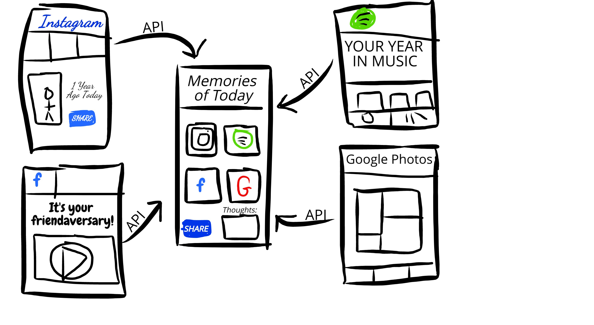
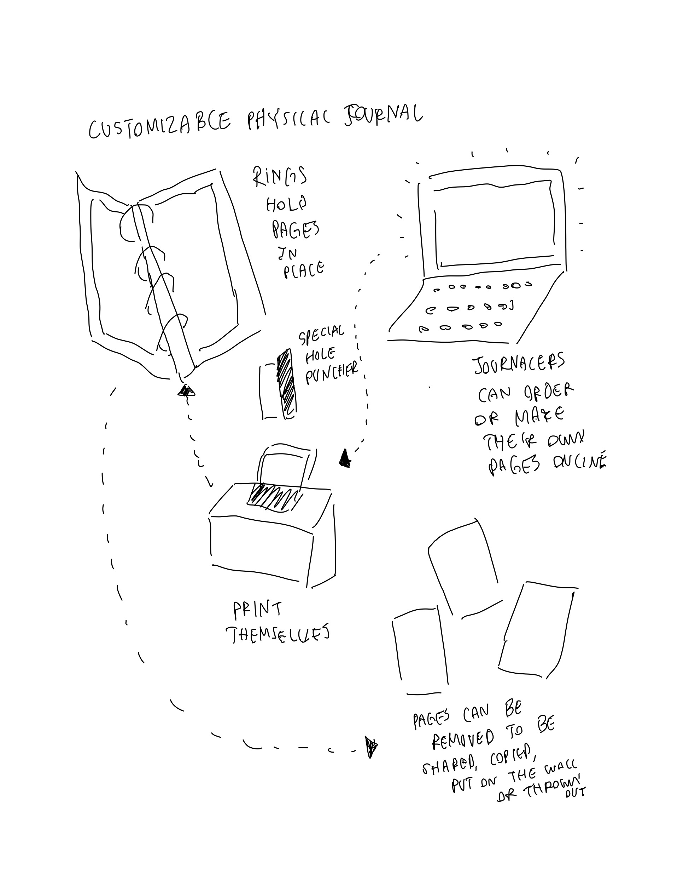
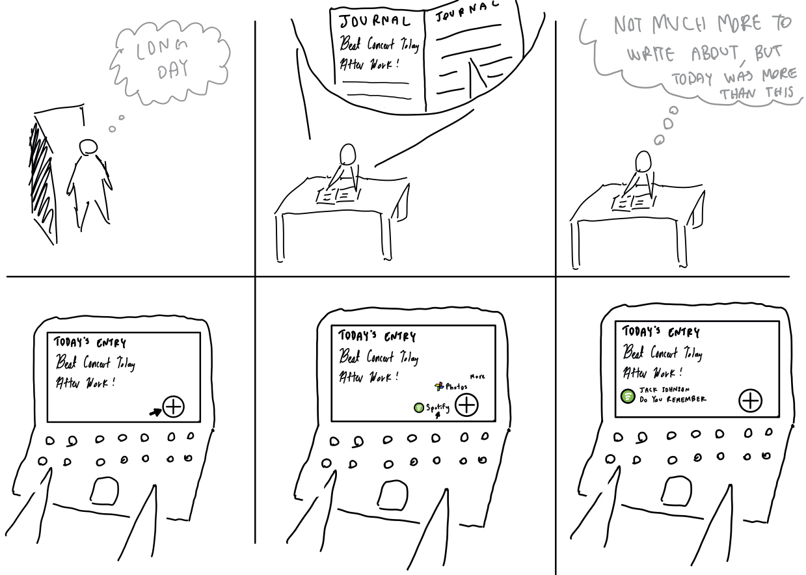

# remi⋅nice
Dana Spillinger, Lucia Viña Patiño, Mitchell Estberg, Patrick Mao

##### Problem and Solution Overview:
In general, people love to look back on memories and experiences whether it brings them a sense of joy and nostalgia, allows them to set goals for the future, or provides a way to process emotions. However, many times, reminiscing proactively seems difficult. Some people struggle to keep journals regularly and others feel like they do not reflect effectively. 

The solution to these difficulties should allow for proactive, timely, and convenient forms of reminiscing. The intent is to allow users to get a beneficial experience no matter how much time they choose to dedicate to reflection. Additionally, users should have the choice of reminiscing with the forms they want, in the way they want, and at the time they want. Our design strives to achieve these goals by providing a web platform that acts as a scrapbook to combine physical and digital media of various forms to record a snapshot of one’s days and memories.

##### Design Research Goals, Methods, and Participants:
Our design research was conducted to help us understand how and why people reminisce and find any pain-points in the process. Some of the questions we focused on include the following: 
- How often do people journal?
- What forms do people use to remember and reminisce?
- What are the major pain points with journaling?
- What do people like to remember?
- What do people not like to remember? 
- Do people prefer physical or digital mediums for journaling?

Our research methods included a survey and three interviews. We chose to conduct a survey because we thought it would give us a broader picture and show us general trends across a population of individuals who do and do not journal. Additionally, as the survey was released before the interviews, it helped us develop better interview questions. We posted the survey on several social media accounts in addition to sending it to peers and family. All responses were made anonymous unless the participant was willing to be contacted for a follow-up interview. Next, we interviewed three random participants at the UW Bookstore and the UW Allen Library. We decided that reminiscing is a fairly universal task and thus wanted to choose relatively random participants to both reflect that and to get a diverse set of opinions. Initially, we had also considered doing a diary study to learn more and test out different forms of journaling, namely free-form vs. prompted journaling. However, after analyzing our survey results, we found that people overwhelmingly prefered free-form journaling and that there could be privacy concerns with collecting participants' entries, so we decided not to proceed with the diary study.

##### Design Research Results and Themes:
In the survey, we received 30 responses, many from college students but also some from the age group 50 and up. The survey was beneficial for quantitative data and visualizing overall trends. One main take away was that the majority of participants have an interest in starting to journal or already journal. Additionally, participants like to reminisce prominently through digital media, like music, photos, and shared memories on social media. To quote one respondent,
>“I find music to be the most effective method as when listening to songs they take me back to very specific moments of my life”.

Lastly, we found that the majority of people that do some form of journaling value the physical form of the journal for its authentic feeling, however, there were still those who prefer digital, for its convenience.

In our interviews we collected 3 unique opinions on reminiscing. The first two interviews were conducted at Allen Library. The first participant communicated that journaling felt like a daunting task. Thus, she reminisced through photos and reflective writing assignments from her coursework. She also mentioned that she would want to journal if it was easier. From the second participant, we learned that journaling in both physical and digital writing is useful; he used Microsoft Word and his physical journal for different tasks. For the final interview, we targeted the UW Bookstore’s diary and journal section in attempt to find a participant with direct interest in journaling. Our third participant used journaling as a form of goal-setting. He liked to make action items and goals from his daily reflections in his digital journal so he could act on those the next day. 

##### Identified Tasks:
To decide on our tasks we drew on insights from both the survey and the interviews. We wanted to create tasks that allow each individual to reminisce in the way they want whether it is in a digital or physical form. The six tasks we identified were the following:
- ***Going back through old media, such as photo albums, to reminisce.*** 
In our survey, we saw that people enjoyed looking back on various forms of media to help them reminisce. For example, our first interview participant said she would like to record her memories with photos so she could look back on them for a better picture of the memory.
- ***Evaluating memories and actively highlighting “more valuable” ones.*** 
This task arose from the fact that many participants recognized a difference between proactive and passive reflection. In the survey, several responses indicated that reminiscing on certains memories can be detrimental or painful. Because of this, we wanted the users of our design to be able to choose what memories are valuable to them to look back on.
- ***Recording in a journal as a way to process thoughts and emotions.*** 
In our survey, many cited their reason for journaling as “a way to organize thoughts/feelings and make difficult decisions easier” and “to process some of the emotions I was having”. Writing can be a form of therapy and help people work out things which are complicated to keep track of mentally.
- ***Drawing insights and making goals pertaining to social experiences from recordings.*** 
Journaling and reminiscing is often done out of a desire to understand one’s self better and, in most cases, to improve. It also, when done consistently, allows for a tracking of behaviors in day-to-day life and an observance of trends. Combining this desire for improvement with the tracking that journaling provides results in goal-setting, which we felt was a task was one our design should support. 
- ***Regular intervals of recording everyday life in a journal*** 
Memories are made up of facts. Without recording the context and detail of a memory—such as the who, the where, and the when— reflecting and subsequently setting goals is practically impossible. Thus, we felt that this task was of utmost importance to address in our design, as it supported all the others. 
- ***Sharing past memories and accompanying thoughts with friends*** 
Some of the best memories are the ones made with those we love. The desire to revisit memories and then share them was an experience that was mentioned in both our interviews and our surveys and thus one that we felt was important to consider with our design.  

##### Proposed Design Sketches:
###### Physical + Digital Interface

This design would involve a combination of smart physical devices as well as an online platform to collect memories from both the digital and physical realm, bridging the gap so that people are able to enjoy the benefits of digital convenience, while retaining the charm of physical experiences. By combining the two forms of medium you retain the authenticity and therapeutic nature of writing in a journal, but the digital complement allows for speed, which addresses many peoples’ concern of journaling taking too much time, as well as sharing and searching options, amongst other features that a physical book simply cannot provide on its own.

###### Online App that Centralizes Media and Digital Presence

This design would be an online platform that grabs data from different services a user is a part of to provide a comprehensive overview of memories in different formats. For example, it might use the Facebook API and Spotify API to generate a scrapbook of your recent trip to Europe, combining the posts and photos you shared along with the music you listened to during your vacation. The goal of this design is to curate a digital snapshot using data that already exists, thus providing a lot of information in a much shorter amount of time. 

###### Customizable Physical Journal

This design is aimed to help people who want to start journaling or those that have some dissatisfaction with their physical journaling experience. It allows people to collect memories in a physical form but opens further flexibility as the journaling can change formats as they write and have the freedom to modify their journals as they see fit. This design is meant to accommodate and celebrate the really individual and personal nature of journaling, and provides people an opportunity to experiment with and curate a journal that works best for them.

##### Selected Design and Storyboards:
We decided to go with a combination of our Physical + Digital Interface idea as well as our API idea because the two together seemed to best address the three core goals of our project: recording, reminiscing, and reflecting. The Physical + Digital Interface idea directly connected to two of our research insights, that there are advantages to both physical and digital, as well as addressing the pain point of recording being time consuming. On the other hand, we felt that the API idea had better connection to another key idea, that people use different forms to reminisce, from music to photos. We decided that both could be incorporated into a single design, without adding too much complexity or detracting from each other. We also decided that the physical components of the Physical + Digital Interface idea, such as the smart pen or scanner, would add a cost barrier which would limit the number of potential users, and its functionality could easily be replaced by a smartphone camera which is more convenient. Ultimately, this combination of the two ideas becomes something which more resembles what we like to refer to as a “digital scrapbook”. We think that this can particularly help address the tasks of daily recording and evaluating memories to find those that are more valuable.

This storyboard demonstrates how our design supports the task of recording everyday life. Based on the results of our research we realized that writing in a physical journal is an important way to do such recording, but not the only way. A written account provides only part of the full picture, which is why the digital component of our design also incorporates things such as music and photos.As shown above, Greg returns from a long day and writes about the concert he attended but struggles to come up with much more to write. However, he realizes that there was more to his day than he is able to effectively articulate on paper, so he uses the digital component to curate a more complete picture. Remi-nice helped him more easily record his memories in a meaningful way.

The task of evaluating memories with intent to highlight more valuable ones and filter unhelpful ones is of vital importance, as shown by our research. While reminiscing is an activity most take part in, there is a fine line between it being an effective means to revisit the past and a gateway to unnecessary dwelling. In this storyboard we demonstrate how Sally had a mostly good day, having done well on her exam and gotten lunch with her friend, but got into a small argument with her mother. However, although she writes about all of those events in her physical journal, she realizes that when she revisits her digital scrapbook she would rather focus on the positives, and thus only uploads what she chooses to.
