### Stud-e

##### Group Members (from left-to-right):  Aerin Malana, Manan Gandhi, Julian Rosner, John Taggart  

   
#### __**Problem and Solution Overview:**__  
Studying is a universal struggle shared amongst students everywhere. Unfortunately, the fact that there is no universal best way to study makes this challenge even more difficult to solve. Also, technology is now often used in curriculums across all disciplines. Since technology (and more specifically, the internet) also can be a great distraction to students, for many students it can be incredibly difficult to manage staying on track when studying with tech-based resources.  
  
When researching our design, we came up with the following three themes:  
##### _There is no universal “best way to study.”_  
##### _Studying in groups is often desirable, but can go poorly for a litany of reasons._  
##### _The internet is both a requirement to complete work and a major source of distractions._  
  
These themes guided us in developing the tasks we could tackle with our design. Ultimately, we decided upon a design that focused upon tasks derived from the first and third themes. We excluded the second theme from our final design since we found that our designs that implemented group-studying functionality significantly shifted the scope and focus of our project away from improving the individual student’s study skills.  
  
Our final design solution, Stud-e, is a personalized study advisor app that uses data recorded from past study sessions to help optimize students’ study session time usage with the assistance of a physical bracelet.  
  
#### __**Initial Paper Prototype:**__  
  
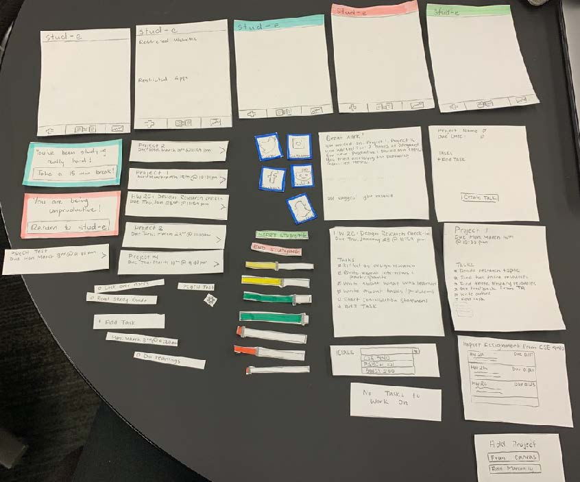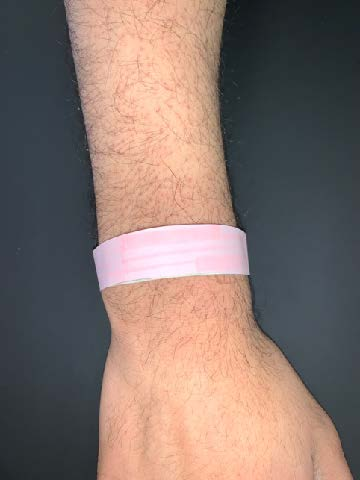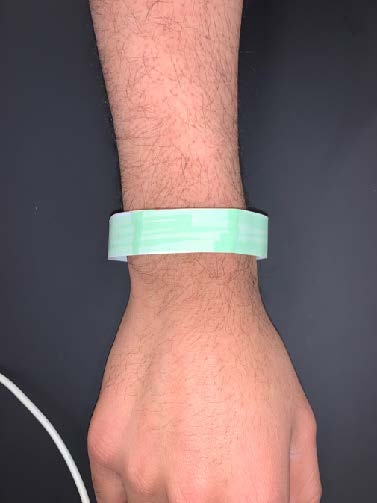  
  
Above is our initial paper prototype. There are two main components for our prototype: our mobile app and our bracelet.  Below are overviews and walkthroughs of the two tasks we chose to refine our paper prototype around:  
  
##### __**Task 1 Overview**__  
The first task we focused upon in our design was receiving suggestions around study habits based upon previous study data. Our design derives these suggestions based on two primary sources:  applications and websites that the user consciously chooses to block, and users initiating a study session by indicating that they want to start “studying” (which triggers the app’s study-session data collection functionality).  
  
If a user tries accessing a restricted website, stud-e knows to block access to it. However, if stud-e notices that you’re distracted on an unrestricted website during the study session it will remember the website and suggest blocking it in the future.  
  
To prevent burnout, the app can also sense when users have been working too long and can suggest taking a break. This is because stud-e is not built to simply promote continual studying, but rather to promote healthy study habits through appropriately managing study breaks. stud-e achieves this during study sessions through the usage of a light-up bracelet. When in a study session, the bracelet turns green. If a user gets off-track/distracted while studying, the bracelet turns red to indicate to the user that he/she should get back to work. Once stud-e grants the user a break and the user then takes a break, the bracelet turns blue to indicate to the user that their current break-time is appropriate. If the break runs too long, the bracelet will turn red, indicating to the user that he/she needs to get back to work.  
  
Once the user completes their study sesion, suggestions based upon the completed session are presented to the user. These suggestions typically contain advice derived from the prior session regarding study break usage and distracting websites. Accompanying these suggestions is a score derived from how productive the user was in the session.  
  
##### __**Walkthrough of Task 1: Study Suggestions**__  
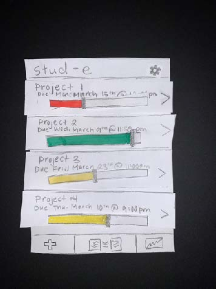  

This is the front page of stud-e. There is a list of tasks, with their respective progress bars, on the page. There is a settings icon on the top-left to show the current restrictions currently in place. Additionally, the buttons on the bottom allow for adding new tasks, data about past study suggestions, and analytics about the current study sessions.   
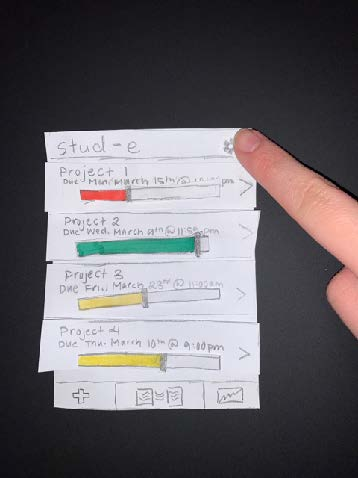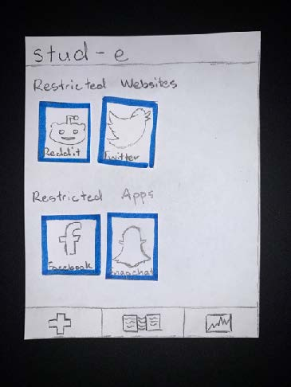  
Upon clicking the settings button, the apps and websites that are blocked by stud-e during study sessions can be seen.   
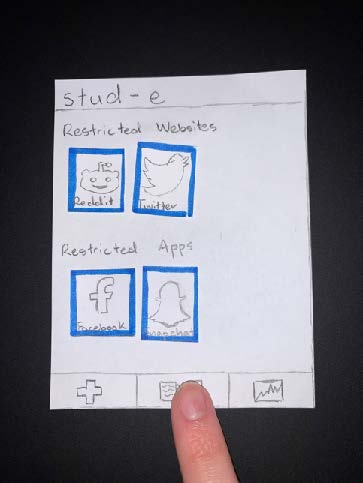  
Now, we return to the list of tasks. We can see that they have now been ordered by priority for the student.   
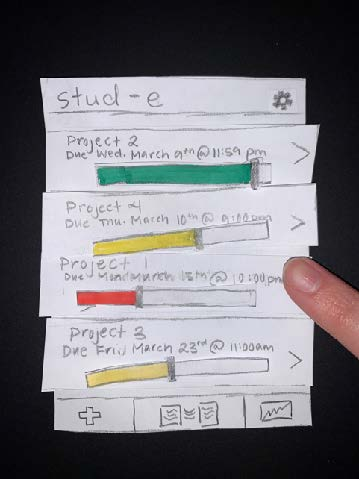  
The student clicks on a task that he or she would like to work on first.   
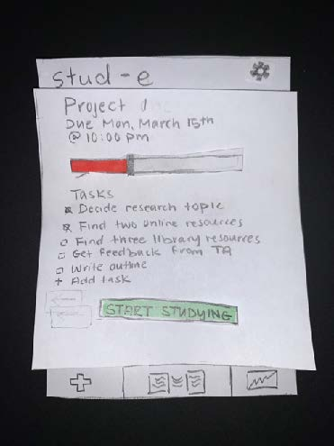  
The student can now see a list of subtasks that must be completed in order to finish the task.   
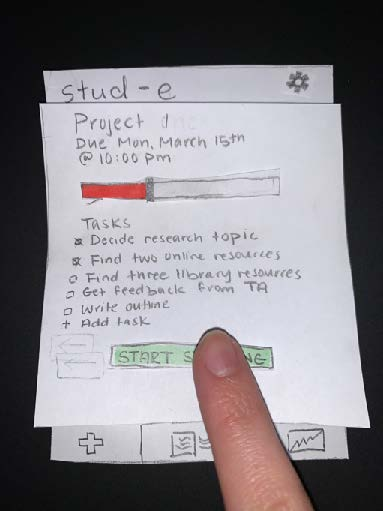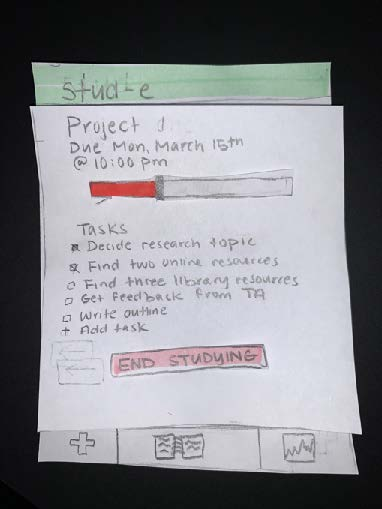  
When the student is ready to start studying, he or she clicks the start studying button.  The app and bracelet turn green.   
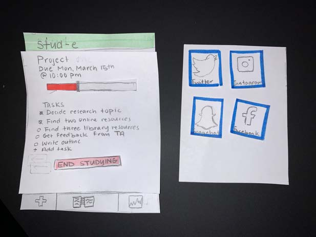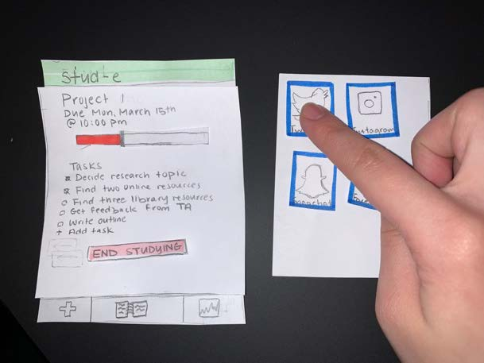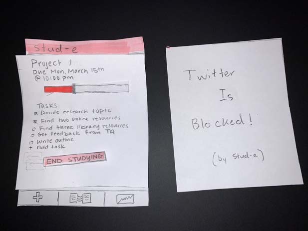  
After some time, the student attempts to use one of the blocked apps. Upon doing so, he or she can see that the app is blocked by stud-e, and hence cannot access any of the app’s features.  The app and bracelet turn red.  
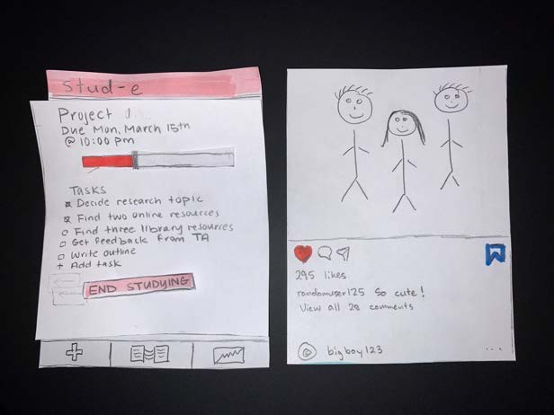  
The student then attempts to access another app (Instagram) that is known by stud-e to be unproductive.  However, the student is still able to access all of the app's features for now.  After 5 minutes on Instagram, the student gets a pop-up on Instagram from stud-e, suggesting they should get back to studying and providing a button to help them do so.  The app and bracelet turn red again.  
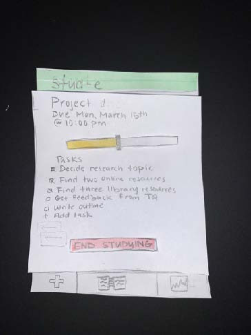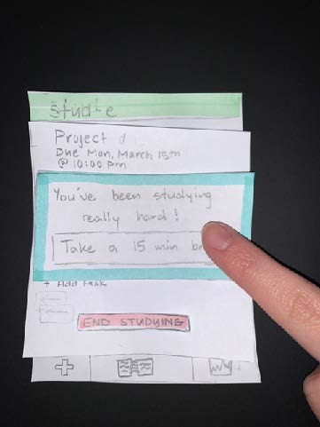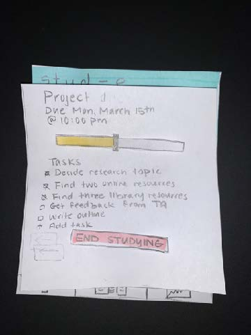  
After making some progress and/or working for a long time, the app suggests the student to take a break. The student can take a break by clicking the button on the pop-up.  
The app and bracelet turn blue.  
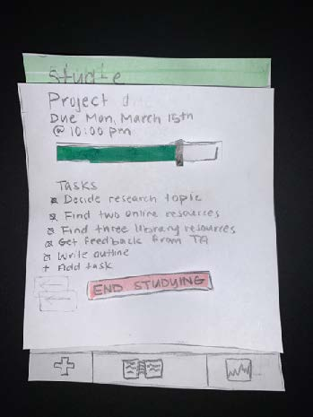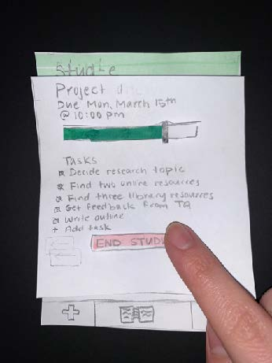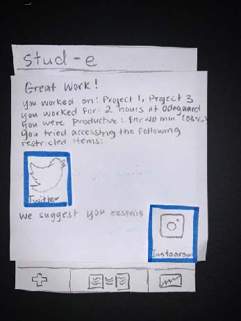  
The student has now finished the task. The student decides to stop studying by clicking the “end studying” button. Once clicked, the student can see suggestions on apps/websites to block in the future, as well as future study tips that may be helpful.   
  
##### __**Task 2 Overview**__  
The second task we focused upon in our design was managing lists of assignments/tasks. On the main screen of our app is a “task” list.  This list provides the user an overview of current tasks/assignments, a progress bar for each task to indicate task completion, and the due dates for each task.  
  
Users can add new assignments/tasks to the list either by importing them from Canvas or through creating them manually from scratch. Additionally, all assignments also show a list of subtasks of a particular task.  
  
##### __**Walkthrough of Task 2: Managing To-Do Lists**__  
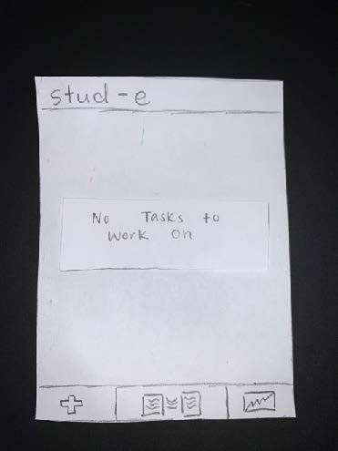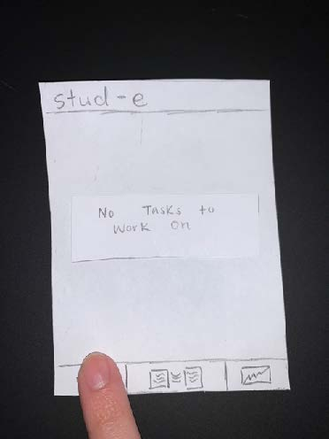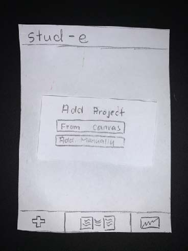  
Here is the home screen for stud-e. The task list is empty, which allows the user to add tasks to their task list.   
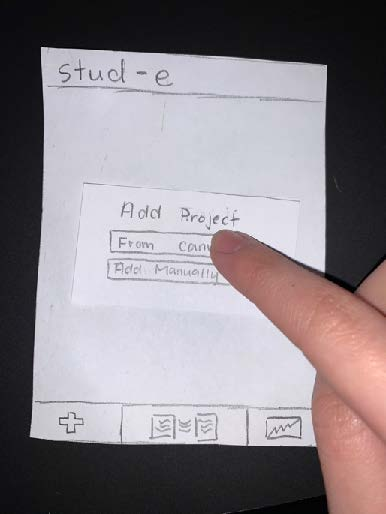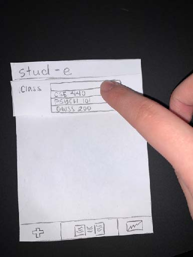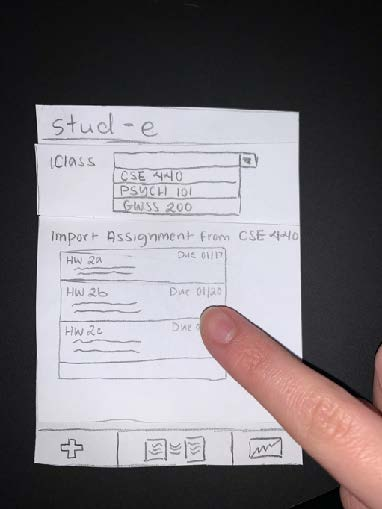  
When a user adds a project from Canvas, they can select their class and homework/project.  
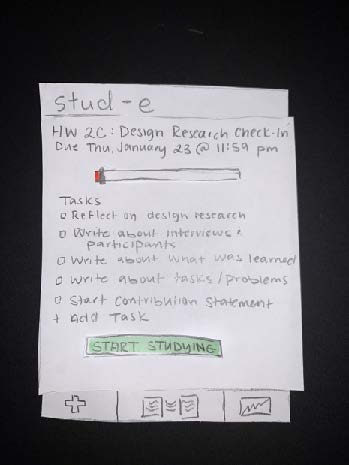  
Once they select their project, the project criteria automatically imports to the app. This will automatically load the project name, due date, and subtask list.  
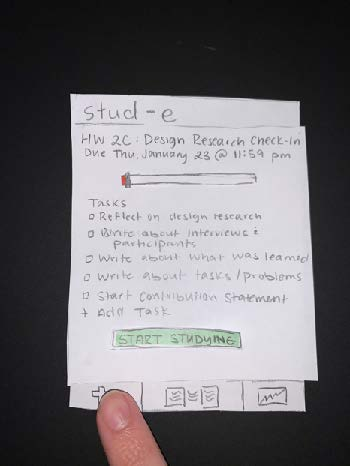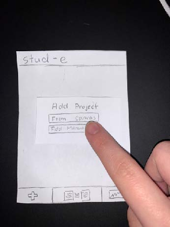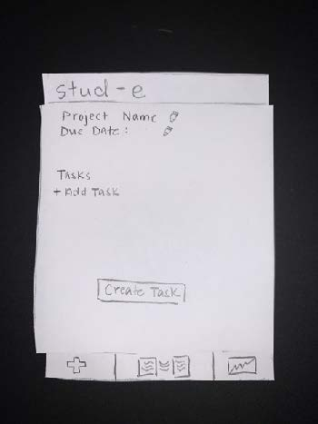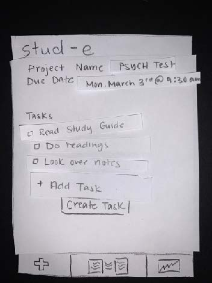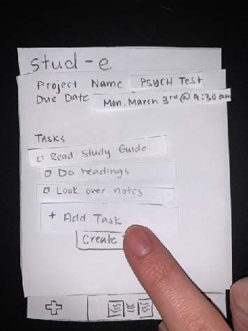  
When a user adds a project manually, they can input their own project name, due date, and subtask list.   
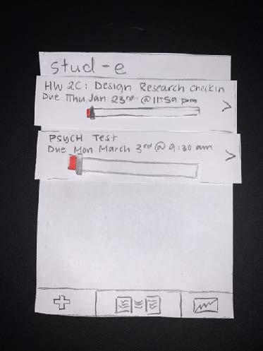  
The newly created projects are now available on the user’s task list.   
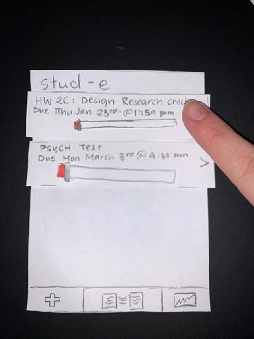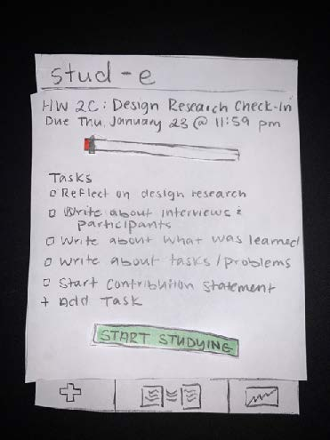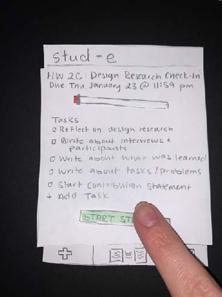  
Once a user has a task they’d like to start working on, they can click that project and hit ‘start studying’ to start logging their work time.  
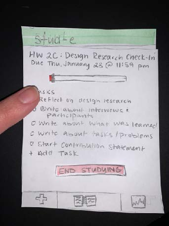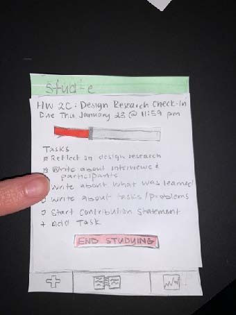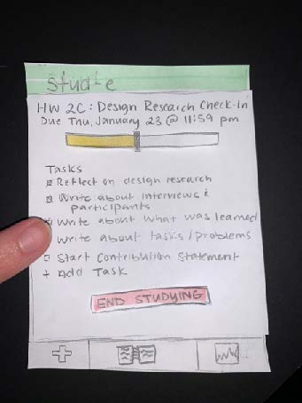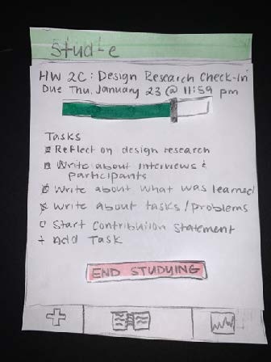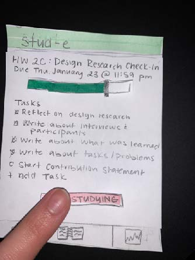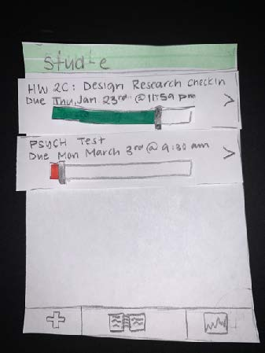  
As they work, they can check off subtasks in their project, the app will reflect their progress on the progress bar.  
  
#### __**Testing Process:**__  
  
To test our prototype, we completed two types of tests:  inspection-based heuristic evaluations and usability tests. We had three participants test our design. Our first two participants completed both types of tests, while our third participant only completed the usability test.  
  
##### __**Participant Overview**__  
As mentioned above, we had three participants, whose names we have obscured for anonymity:  
* J, a 4th year CSE Student from CSE440  
* A, a 2nd year CSE Student from CSE440  
* S, a 3rd year CSE Student from CSE440  

As stated before, J and A completed both Usability Tests and Heuristic Evaluations while S only completed a Usability Test.  
  
##### __**Heuristic Evaluation Testing Process**__  
When completing a heuristic evaluation, we provided the evaluator with a copy of the CSE440 sheet of design heuristics to evaluate our prototype with.  Since both of our Heuristic Evaluation tests were completed with classmates from CSE440, we did not have to bother nor worry too much about explaining how to conduct a Heuristic Evaluation to either of them.  Our evaluators completed their evaluations both passively with their Usability Tests and as their sole focus after they had completed their Usability tests.   
  
##### __**Usability Test Process**__  
For each of our Usability Tests, we initially made participants explore the prototype on their own for a few minutes and had them complete our two tasks.  When completing our Usability Tests, we had two roles:  listed below are each role alongside who took each role in each of the three tests:  
* Facilitator/Computer: Traditionally, the Facilitator and Computer roles are separate when Usability Testing.  The Facilitator guides users through the test and prompts their thoughts while the Computer lays out the components for each element of the prototype.  In our testing, we decided to merge these two roles.  
    * Test 1: Aerin  
    * Test 2: Manan  
    * Test 3: Julian and Manan  
* Observer: Notetaker during the test.  
    * Test 1: Manan  
    * Test 2: Manan  
    * Test 3: John  

We debriefed with each participant for a few minutes afterwards, asking them questions regarding what he/she felt should be added/removed/changed about our design.  
  
##### __**Usability Testing Process Refinement**__  
For the first test, before we did anything we walked the user through the various features and functionalities of the app.  When reflecting upon our first test, we realized that by doing this we effectively ruined that test’s usefulness in determining the intuitiveness of our design.  
  
For our second and third tests, we did not provide the participants with any sort of walkthrough of the app beforehand (so we could see how easy our app was to understand).  Instead, we had the participants jump right into working upon our two tasks.  We typically gave guidance in these two tests along the way only if the participant got stuck for a while trying to figure out what to do next.  This more quality results than the first test regarding the intuitiveness of our design.  
  
For our third test, we let the participant explore the app a bit after completing the tasks because we had some spare class time (Test 3 was completed in Quiz Section).  This exploration yielded interesting critiques from the participant about aspects of our design that were not necessarily used to complete our two tasks.  We feel that we ultimately got some of our most useful critiques from our third Usability Test because we had the participant complete this exploration of our design.  
  
#### __**Testing Results and Prototype Refinement:**__  
For each of the following subsections, we will first present the various critiques of our design accompanied by the respective changes made as a result of each critique.  After presenting these critiques, there will be summaries of the overarching themes we derived from these critiques about how we needed to adjust our design.  If you don't feel like reading too many of the details/are short on time, feel free to skip the full critique breakdown to get to the summaries for some TL;DRs.
  
##### __**Inspection-Based Heuristic Evaluation Results**__  
  
###### __**Inspection-Based Heuristic Evaluation Critiques**__  
Below are the critiques made by our evaluators in our Heuristic Evaluations accompanied by the revisions made in light of them:  

---

###### __**Before:**__  
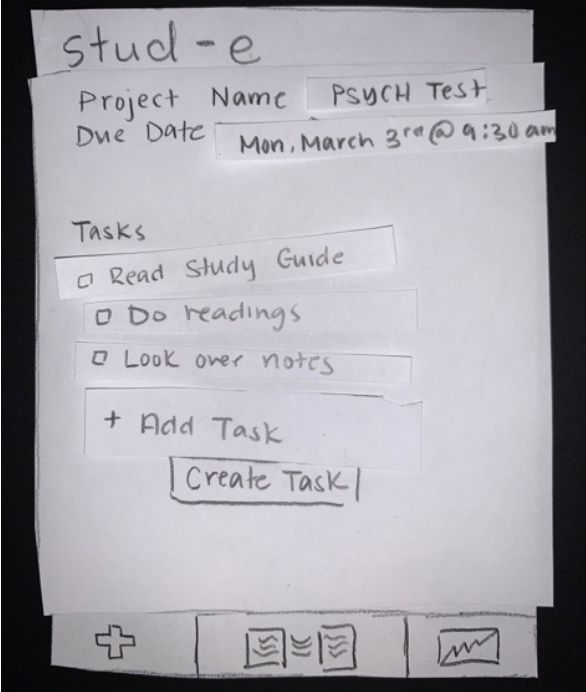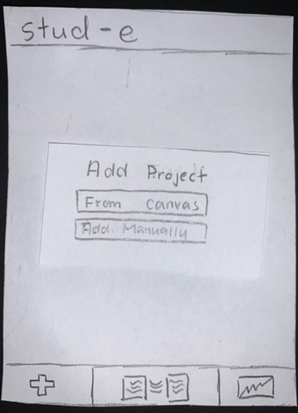

###### __**After:**__  
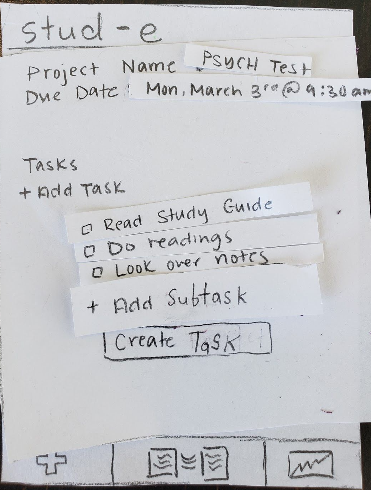 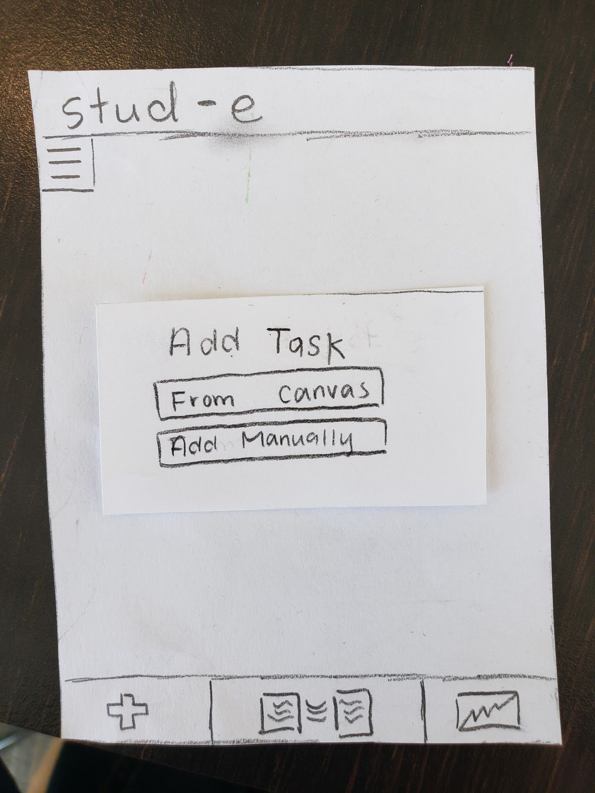   

###### __**Critique Breakdown:**__ 
* Issue: Inconsistency in the usage of the terms “task”, “subtask”, and “project” throughout the app.  
* Heuristic Violated: Consistency and Standards  
* Prototype Revision: Revised project verbiage to only use the terms “Task” and “Subtask” to refer to an assignment/project and elements of that assignment/project, respectively.  
  
---

###### __**Before:**__  
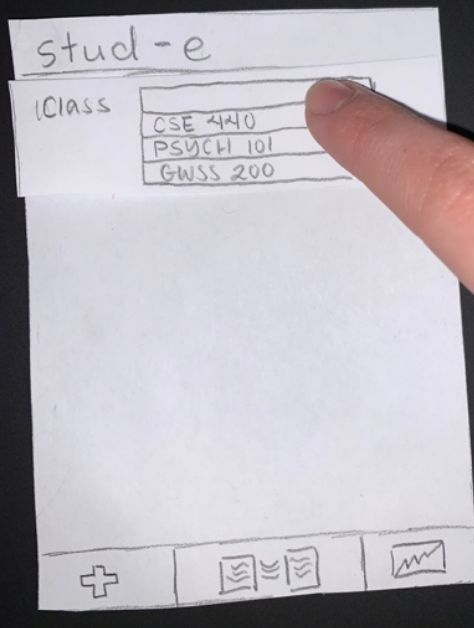

###### __**After:**__  
\<no changes were made\> 
###### __**Critique Breakdown:**__ 
* Issue: There’s no “Create Project” button when adding a project directly from Canvas.  
* Heuristic Violated: User Control and Freedom, Consistency and Standards  
* Prototype Revision: By fixing the verbiage in our design to make projects mean tasks, it turns out that this functionality was already implemented elsewhere under an “Add Task” button.  No further redesigns were necessary.  
  
---

###### __**Before:**__  
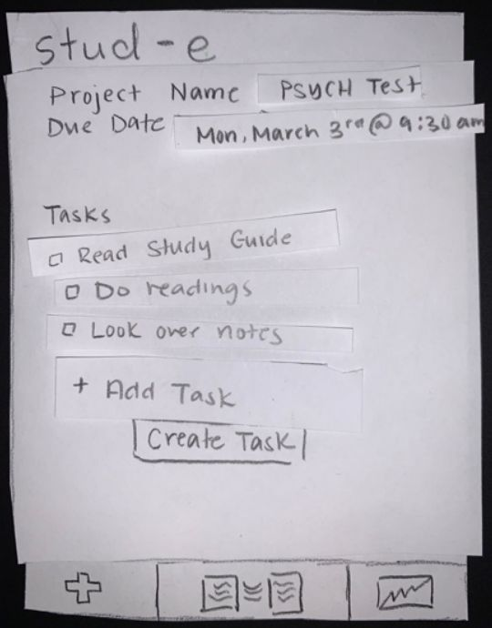

###### __**After:**__  
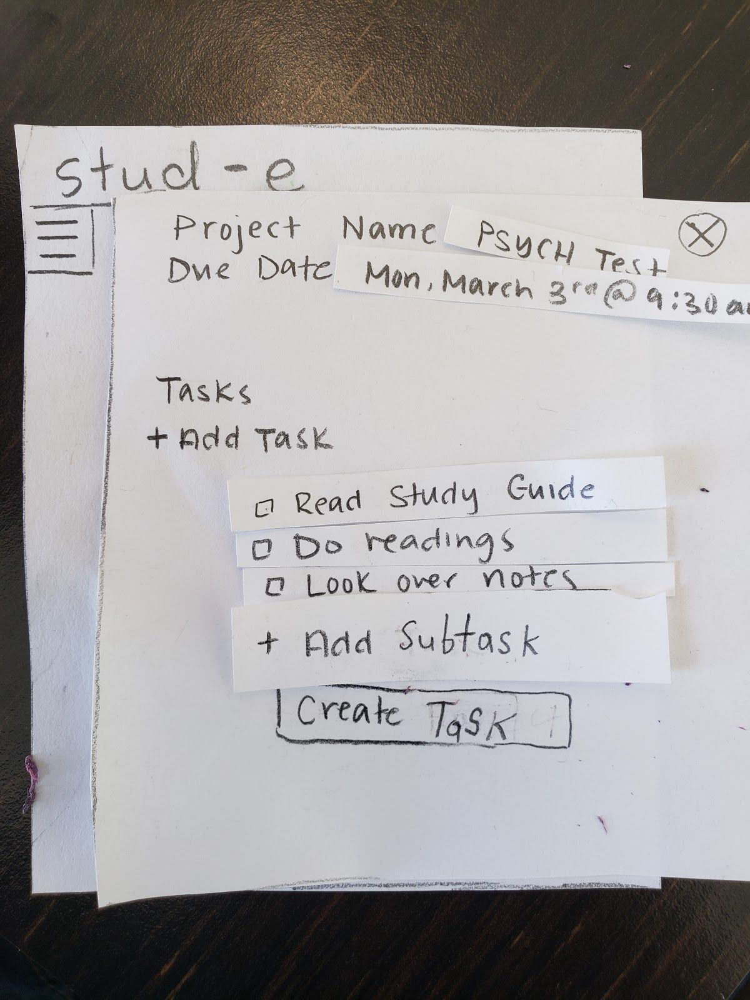   

###### __**Critique Breakdown:**__ 
* Issue: UI navigation design is unclear (no back button, unclear/non-standard icons at bottom of screen for navigation).   
* Heuristic Violated: User Control and Freedom, Recognition Rather than Recall  
* Prototype Revision: Added a “hamburger button” to easily navigate from any major page of the app to any other page and an “X” button to back out of the task creation page.  
  
---

###### __**Before:**__  


###### __**After:**__  
  

###### __**Critique Breakdown:**__  
* Issue: There’s a lack of edit buttons, which doesn’t make it clear to users that there's a field they can edit input.  
* Heuristic Violated: User Control and Freedom, Consistency and Standards  
* Prototype Revision: Add edit buttons to appropriate fields, outline said fields to communicate that they can be edited.  
  
---

###### __**Before:**__  


###### __**After:**__  
   

###### __**Critique Breakdown:**__ 
* Issue: Unclear to users how to switch between tasks while in a study session.  
* Heuristic Violated: User Control and Freedom  
* Prototype Revision: Add a back arrow in the upper left of the interface when viewing a task while studying.  
  
---

###### __**Summary of Results/Overarching Themes**__  
Across these critiques there were two themes that primarily stood out:  
###### __**Unclear Navigation UI**__  
The strongest theme across these critiques was that our UI was not the most intuitive to navigate.  Users were unable to figure out how to access the various functionalities of the app, were unable to edit the tasks they created, and were unable to back out of the current context of the app when desired.  We fixed these UI problems by adding a hamburger button that popped open an explicitly labelled list of app navigation icons, adding “X” and back-arrow buttons to certain screens, and adding an “edit” button to the task screen.  We believe these fixes worked:  in further testing, navigation proved to no longer be a problem.  

###### __**Inconsistent Wording**__  
A second, but major theme of the critiques was that the usage of the terms “Project”, “Task”, and “Subtask” throughout the prototype was inconsistent, incorrect, and confusing.  The usage was so confusing, in fact, that some users critiqued that we should add already present functionality that they could not find due to the usage of the wrong term.  After receiving these critiques, we went through our design and revised our terminology usage.  We did not have any problems with terminology in further testing.  

##### __**Usability Testing Results**__  
  
###### __**Usability Testing Critiques from Tests 1 and 2**__  
We did not revise our paper prototype at all between the first two tests.  Below is feedback from the first two tests accompanied by how we revised our prototype accordingly (if any adjustments were made):  
  
---

###### __**Before:**__  


###### __**After:**__  
   

###### __**Critique Breakdown:**__ 
* Issue:  Participant would like to see the estimated amount of time left to complete a task when working.  
* Prototype Revision: Display an estimated length for every assignment based on past experience from similar types of assignments in similar classes.  
  
---

###### __**Before:**__  


###### __**After:**__  
   

###### __**Critique Breakdown:**__ 
* Issue:  Participant would like to have some sort of score to quantify their productivity in a each prior study session from 1 to 100 rather than suggestions of how to improve their study skills.  
* Prototype Revision: While presenting some kind of score between 1 and 100 to more simply communicate with the user does seem like a good idea, using this to replace all our feedback is not.  As a result, we decided to just add a score to the session statistics screen.  
  
---

###### __**Before:**__  


###### __**After:**__  
\<no changes were made\>  

###### __**Critique Breakdown:**__ 
* Issue:  Participant felt that there was no way for the user to know that the bracelet is connected/turned on to the app’s functionality.  
* Prototype Revision: No revision was made here because our bracelet already conveys that it isn’t powered on by simply not lighting up at all.  
  
---

###### __**Before:**__  
\<screen did not exist\>

###### __**After:**__  
   

###### __**Critique Breakdown:**__ 
* Issue:  When on break, the user should be able to know that the blocked apps and websites should now be available for use.  
* Prototype Revision: Added a screen to notify the user when it is time to take a break and explain that blocked websites are accessible during the break..  
  
###### __**Usability Testing Critiques from Test 3**__  
After our first two tests, we revised our prototype for our third test.  Below is feedback from the third test accompanied by how we revised our prototype accordingly (if any adjustments were made):  
  
---

###### __**Before:**__  
\<screen did not exist\>

###### __**After:**__  
  

###### __**Critique Breakdown:**__ 
* Issue:  The participant noticed that despite having an edit button on our task screen we didn’t actually include the screen that button would take the user to in our paper prototype.  
* Prototype Revision: We added an “edit task” screen.  
  
---

###### __**Before:**__  


###### __**After:**__  
  

###### __**Critique Breakdown:**__ 
* Issue:  The participant found the distinction between “Restricted Websites” and “Restricted Apps” confusing.  
* Prototype Revision: We removed the distinction and merged the two into a “Restricted Websites and Apps” list that is synchronized across devices with stud-e installed.  
  
---

###### __**Before:**__  


###### __**After:**__  
<  

###### __**Critique Breakdown:**__ 
* Issue:  Participant desired an option to import assignments from Canvas based on due date.  
* Prototype Revision: We now include an option to import all homework assignments from a given class as soon as the due date is close enough to the current date. What “close enough” means is specified by the user in the app’s settings, but the default value is set to 2 weeks.  
  
---

###### __**Before:**__  
\<screen did not exist\>

###### __**After:**__  
  

###### __**Critique Breakdown:**__ 
* Issue:  The participant does not feel that successes are celebrated sufficiently.  
* Prototype Revision: Every 30 days, the app now gives users encouragement by reminding them of how much they have improved while using stud-e.  This celebration of user’s victories should keep their motivation high.  
  
---

###### __**Before:**__  

###### __**After:**__  
  

###### __**Critique Breakdown:**__ 
* Issue:  The participant found the placeholder line graphs in the results screen to be confusing and unreadable.  
* Prototype Revision: The line graphs have been replaced with much more readable bar charts. Study score is now tracked instead of “time spent being unproductive”.  
  
---

###### __**Before:**__  
\<screen did not exist\>

###### __**After:**__  
  

###### __**Critique Breakdown:**__ 
* Issue:  Participant would like to have some way to review her study feedback from previous days.  
* Prototype Revision: Screens were added that display study data and feedback related to each particular date in the review data screen.  
  
---

###### __**Summary of Results/Overarching Themes**__  
Below are two themes derived from the above critiques:  
  
###### __**Interpreting Study Session Success**__  
Throughout all of these critiques, one main theme became apparent:  our design did not quantify and display the recorded data in a way our users found extremely useful.  Based upon our critiques, we gradually overhauled our feedback mechanism to be more readable/concise (through a “score” mechanism and bar graph usage) and more in-depth (through feedback pages and assignment work-time estimates) than before.  We felt that fixing these complaints was crucial since a major part of our design (self-improvement via reading reports on past sessions) depends upon users being able to easily and quickly interpret the data presented to them.  
  
###### __**Missing Elements**__  
Some critiques of our design centered around the fact that we did not have certain screens available to interact with in our paper prototype (for example, the “Edit Task” screen and the date-specific “Study Feedback” screen were missing).  To accommodate these critiques, we decided to create these missing elements of our paper prototype.   
  

  
#### __**Final Paper Prototype:**__  
  
 

Above is an overview of our revised paper prototype.  
  
##### __**Walkthrough of Task 1: Study Suggestions**__  
  

This is the front page of stud-e. There is a list of tasks, with their respective progress bars, on the page. There is a “hamburger” icon in the top-left to navigate the app.  
  

Clicking the “hamburger” button pulls up a menu with navigation options for settings, adding new tasks, viewing current tasks, and viewing reports.  
  

Upon clicking the settings button, the apps and websites that are blocked by stud-e during study sessions can be seen.  The student taps the hamburger icon to return to the navigation options menu.  The student chooses to navigate to “Tasks” this time to see what he/she needs to get done.  
  
The student sees the list of tasks he/she needs to get done.  They are organized in order of priority for the student.  
  
When the student is ready to start studying, he/she clicks the start studying button.  
The app and bracelet turn green.  
  
The student can now see a list of subtasks that must be completed in order to finish the task.  
  
After some time, the student attempts to use one of the blocked apps. Upon doing so, he or she can see that the app is blocked by stud-e, and hence cannot access any of the app’s features.  The app and bracelet turn red.  
  
The student then attempts to access another app (Instagram) that is known by stud-e to be unproductive.  However, the student is still able to access all of the app's features for now.  After 5 minutes on Instagram, the student gets a pop-up on Instagram from stud-e, suggesting they should get back to studying and providing a button to help them do so.  The app and bracelet turn red again.  
  
After making some progress and/or working for a long time, the app suggests the student to take a break. The student can take a break by clicking the button on the pop-up.  
The app and bracelet turn blue.  
  
The student has now finished the task. The student decides to stop studying by clicking the “end studying” button. Once clicked, the student can see suggestions on apps/websites to block in the future, as well as future study tips that may be helpful.   
  
##### __**Walkthrough of Task 2: Managing To-Do Lists**__  
  
Here is the home screen for stud-e. The task list is empty, which allows the user to add tasks to their task list.   
  
When a user adds a “Task” from Canvas, they can select their class and homework/project.  
  
Once they select their “Task”, the “Task” and “Subtasks” automatically import to the app. This will automatically load the “Task” name, due date, and subtask list.  
  
When a user adds a “Task” manually, they can input their own “Task” name, due date, and subtask list.   
  
The newly created “Task” is now available on the user’s task list.   
  
Once a user has a “Task” they’d like to start working on, they can click that “Task” and hit ‘Start Studying’ to start logging their work time.  
  
As they work, they can check off “Subtasks” in their project, the app will reflect their progress on the progress bar.   
  
#### __**Digital Mockup:**__  
  
  
Above is an overview of some basic elements from our digital mockup.  
  
##### __**Walkthrough of Task 1: Study Suggestions**__  
  
This is the front page of stud-e. There is a list of tasks, with their respective progress bars, on the page. There is a “hamburger” icon in the top-left to navigate the app, which pulls up a menu with options for settings, adding new tasks, viewing current tasks, and viewing reports.  
  
Upon clicking the restrictions options, the apps and websites that are blocked by stud-e during study sessions can be seen.  The student taps the back button to return to the task list to see what they need to get done. The student sees the list of tasks he/she needs to get done.  They are organized in order of priority for the student.  
  
The student can now see a list of subtasks that must be completed in order to finish the task. When the student is ready to start studying, he/she clicks the start studying button. The app and bracelet turn green.  
  
After the user tries to access a restricted app or website, the bracelet and app turns red and alerts the user that they’re being unproductive. The app tracks that instance of unproductivity.  
  
After making progress for a long amount of time, the app suggests that the student takes a break to prevent burnout. The bracelet turns blue and alerts the student on the app to take a break.  
  
When the students want to finish studying, they can click ‘end studying’. This will end their study session and give them data and feedback based on that study session.  
  
##### __**Walkthrough of Task 2: Managing To-Do Lists**__  
  

Upon entering the app, students are presented with a prioritized list of tasks that are still to be completed. Students can either click on the right arrow next to each task to begin working, or choose to add tasks at the bottom of the screen. Students can manage to-do lists by adding tasks from canvas or from scratch.  
  
When adding from Canvas, students can search the class name and assignment, and then add it to their task list. They can also edit or modify the assignment from Canvas along the way.  
  
If adding manually, students enter in information as well as subtasks that correspond to that task.   
  
##### __**Changes From Paper Prototype to Digital Mockup**__  
Below is an overview of the changes we made to our design in the process of transitioning our design from a Paper Prototype to a Digital Mockup.  
  
###### __**Changes Relevant to Task 1**__  
As before, our first task consists of giving users suggestions based on their past study data. In our shift from a paper prototype to a digital mockup, we added in a log in screen, changed the layout of our restricted apps/website page, and improved the final study suggestions page in order to make the data a little more user-readable.  
  
###### __**Changes Relevant to Task 2**__  
Our second task involves creating and organizing task lists for user assignments. We directly translated our main task list page over and refined the process of creating new tasks.  
  
###### __**Other Changes**__  
There are many minor changes we made to our design when creating the design mockup:  
* Most of our navigation features (bracelet settings, restrictions, task list, etc.) were moved into our hamburger menu.  
* Made our logo more colorful to incorporate more color into our design.  
* Designed, created, and added operationally-necessary pages that were not initially part of our paper prototypes such as a log-in screen and a bracelet-pairing screen.   
* Increased the user’s ability to edit more than just tasks/subtasks throughout the app by increasing the presence of edit buttons.  
* Increased the presence of the bracelet in the design of our software (for example, the app shows the bracelet’s remaining charge).   
