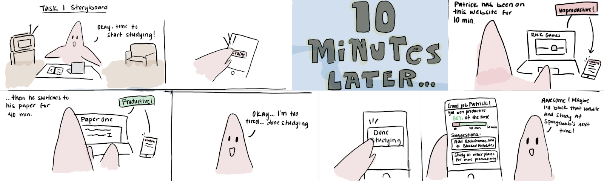
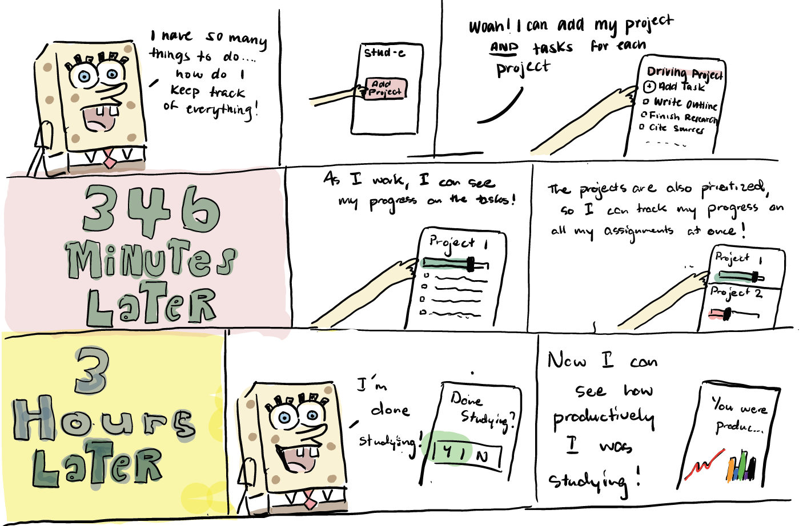

# Stud-e
### Group Members:  Aerin Malana, Manan Gandhi, Julian Rosner, John Taggart

## __**Problem and Solution Overview:**__
Studying is a universal struggle shared amongst students everywhere.  When completing their coursework, students have to juggle meeting deadlines, preventing burnout, avoiding distractions, measuring their own knowledge of their coursework, and aiming for solid grades.  Unfortunately, the fact that there is no universal best way to study makes this challenge even more difficult to solve.  Also, technology is now often used in curriculums across all disciplines.  Since technology (and more specifically, the internet) also can be a great distraction to students, for many students it can be incredibly difficult to manage staying on track when studying with tech-based resources.  
  
Stud-e is a personalized study advisor app, using data recorded from past study sessions to help optimize students’ study session time usage.  Stud-e does so via tracking study sessions, recording students’ progress via either passive digital tool integration (i.e. Canvas) or actively surveying the student about their own progress after the completion of a study session.  It then references this data to provide feedback.  During future study sessions, stud-e actively provides guidance on how to best optimize students’ study time through an app-connected bracelet that guides users based upon productivity estimates derived from the collected data to take breaks, resume studying, or conclude their studies for the day.  The data is also compiled, analyzed, and stored in an easy-to-read format so that each student can observe how productive he/she was in prior sessions and consciously learn how to improve upon his/her past study habits.  Lastly, stud-e can block access to recorded distractions from breaks or unproductive sessions to prevent students from getting too off track in their studies.  

## __**Design Research Goals, Methods, and Participants:**__  
In doing our research, our goal was to gain insight into the following:  

* Which study habits are associated students with a good GPA/successful students.
* Different types of study habits.
* How people track their productivity.  
* Good/bad study environments.  
* Desired features in a study habits-improvement tool.  
* Break-taking habits.  
* How students deal with distractions.  
* How students allocate time for studies.  
* How much of the average student’s coursework is physical and how much is digital.  

By learning about the above, we would better be able to design a product around the needs of students that works within the limitations provided by their busy lives.  
  
To complete our research, we completed structured interviews with six different participants spread across various ages, majors, levels of education, and gender.  We chose to do interviews as our study method since we (correctly) assumed that each student has their own unique study habits and that an interview format would be the most effective and efficient way to learn about them.  We made the interviews structured to somewhat standardize our results.  While we originally considered doing contextual inquiries as well, we could not figure out a way to do so without either messing up the results by making the participant aware of our presence or being creepy by telling a participant that we had been observing them without them knowing for an extended period of time.  To find interviewees, we both interviewed participants in Odegaard Library and interviewed friends we knew personally.  We did this since random interviewees may be more honest in their results, and familiar interviewees may care more about their answers and therefore be willing to go more in-depth about them.  Below is a quick overview of the demographics of each of the participants we interviewed:  

* Andrew - 2nd Year 3.5-4.0 CS Student interviewed at Odegaard Library.  
* John (not John Taggart though) - 1st Year 3.5-4.0 CS Student interviewed at Odegaard Library
* Christopher - 2nd Year Undeclared Student intending to major in Physics unaware of GPA interviewed at residence
* Robert - 3rd Year 3.72 Supply Chain/Business Student interviewed at residence
* James - UW Class of 2019 Alumni studying for MCATs with 3.6 GPA in Biochemistry interviewed in Tacoma
* Pallavi - 2nd Year 3.0-3.5 Business Student interviewed at residence  
  
## __**Design Research Results and Themes:**__
In the end, our research was incredibly successful.  Across our participants, we received a diverse range of responses to each of our questions, providing us with a dataset from which we derived the following three themes: 

### _There is no universal “best way to study.”_

Across participants, the “best way to study” varied wildly;  in fact, some participants’ “best” ways to study were near-identical to others’ “worst” ways to study.  For example:  Christopher thrives on studying with friends from other classes, while Robert and James explicitly stated that they do poorly in those environments.  Some participants never take breaks (James, John), while others take breaks somewhat often (Robert, Andrew).  The discrepancies found between our participants’ study habits in our research indicate that whatever solution we come up with must tailor to the individual in some way.  This meant designing something that learns and informs what does/does not work for an individual from recording their study habits.

### _Studying in groups is often desirable, but can go poorly for a litany of reasons._

Not a single participant interviewed explicitly said that they did not want to study with others for a personal reason.  Some, in fact, reflected upon having extremely positive prior study experiences with other students.  However, all participants mentioned that group study sessions can be hard since a whole group can be distracted more easily than an individual.  James even mentioned that the amount of time often spent having to bridge the gaps in knowledge between participants deters him from studying in groups.  In our solution, we would need to tackle these issues of group distraction and comprehension.

### _The internet is both a requirement to complete work and a major source of distractions._

All participants noted that their coursework most often requires a digital aspect, usually involving the internet.  Most participants mentioned websites and internet-based apps as a source of breaks and distractions as well.  The requirement of using the internet makes it a distracting temptation impossible to turn off.  Our solution would have to be able to help participants manage and focus their internet usage in a way that minimizes distractions and maximizes productivity during their study sessions.

## __**Identified Tasks:**__
After reflecting upon our design research interview transcripts and themes, we came up with the following potential tasks for our project:

 ### **1. Details regarding the user’s study habits are recorded and used to generate feedback on how to maximize their study time**
When interviewing students, it became apparent that time management and scheduling were common tasks across the interviewed students.  For example, Pallavi noted that she has to juggle events for her business fraternity, studying, doing chores, hanging out with friends, and more.  Since she has to schedule day-to-day events, she’d like to know what time of the day would be best for her to study most productively.  She noted that her focus varies depending on what point she is at in her day:  during some hours of the day, she is more distracted than others.  As a result, she ends up spending a lot of time trying to fit in studying whenever she has free time.  Obviously, this is less than optimal, so we decided our project could pursue this task.

### **2. Journaling Data About a Particular Study Session**
Although gathering data may be useful in accomplishing our project’s goals, the collected data also can provide value to the user. For instance, when our design reports to the user for what percentage of study time they tend to spend productively, the user will be able to use that in the future to better estimate how much time he/she should allocate to accomplish a given study-related task. Metadata we believe our users would find useful for a given study session include: total time spent, time spent productively, time spent distracted, which apps or websites were accessed the most when distracted, when the session started, where the session took place, who else was present, and how productive the session subjectively felt to the user.

### **3. Coordinating and making group study time as productive as possible**
As mentioned in the theme-section above, no participant explicitly said that he/she was opposed to studying with others.  However, John, Christopher, and James all described instances where studying in a group actively detracted from their productivity.  For John and Christopher, one member in each of their study groups managed to derail the whole groups’ studying efforts.  For James, one group member’s competency in the curriculum was below the rest, so everyone was stuck teaching him in order to get him caught up on the materials.  In all cases, one group member burned through valuable study time.  We decided to look into having our project tackle this task in order to help allow for more-productive group work.

### **4. Managing and Tracking Appropriate Breaks**
Taking breaks is key to a successful study session, so it was pretty unfortunate when we found that students often mismanaged their breaks.  James, for example, studies for extremely long, continual periods without breaks due to the little study time he has, leading to burnout.  On the opposite end of the spectrum, Christopher would take breaks that often overstayed their welcome, leading to nothing getting done at all.  Thus, he typically decides to take very few.  Since taking a study break to refresh yourself is key to student success, we decided to pursue creating a solution that manages suggesting and providing optimal breaks for students.

### **5. Alerting Users When They’ve Been Not Productive/Distracted for Too Long**
As mentioned in the previous task, some students (such as Christopher), take a break and get distracted for far too long.  This (obviously) results in getting very little done over a very long period of time.  This very obviously detracts from student productivity, so we decided that our project should probably pursue this task by keeping track of the nature and length of the breaks students are taking.

### **6. Managing to-do lists and tracking progress**
When interviewed, Pallavi noted that she often struggles to stay on topic during study sessions, mostly due to the fact that she feels overwhelmed with different, multi-component-based tasks. She wishes there was a way for her to systematically track and visualize her progress on all the different tasks she was working on. She believes that having a better way to track her productivity and using it will keep her more engaged with the content she is working on. Additionally, John noted that he uses many of the current applications that are out there to manage to-do lists and track his progress, but he doesn’t feel “motivated” to continue using them after a short period of time. With a simple yet effective way to manage to-do lists and track progress, he believes that he will be more inclined to stick with these tools, thereby improving his productivity.  Based off of these two interviews, we decided that the task of managing and tracking progress in coursework would be integral to our final product.

## Proposed Design Sketches
With the research process complete and some key functionalities laid out before us, it was time to begin brainstorming. Ultimately we produced three distinct designs, each with a different idea at its core. First, there was the self-journaling design, which emphasized user-provided, qualitative data. Second was the group study design, which was all about helping people collaborate productively. Then last we had our automated design which centered around making the process of studying as simple as possible for the user.

### **Design 1: Journaling**
  
This first design is a mobile application that stores information collected from the user about their previous study sessions. As soon as a user finishes studying for the day, they would fill out a short questionnaire concerning the session and how certain factors affected their productivity. This questionnaire would be centered around collecting data that is subjective to the user, thus capturing information that no automatic process running in the background could. 

Questions of this type include:

* On a scale from 1-to-5 how productive did this session feel to you?
* On a scale from 1-to-5 how much stress were you feeling when you started studying and how much are you feeling now?
* Are you happy with how this session turned out?  Why or why not?
* Do you feel some part of the environment played a positive or negative role in your ability to focus?
* Were other people around you?  If so, how do you feel they affected your productivity?

The responses to these questions would then be logged for future reference for the user, in hopes of creating a sense of mindfulness. Our research tells us that the simple act of considering questions like those above can allow the user to gain insight about themselves that they wouldn’t otherwise.  Users may realize things such as:  “Wow, whenever I study in the library I end up putting a one or two down for my productivity, maybe I should stick to studying in my room!”

Other features this designs supports include:

* A simple to-do list program
* Logging the length and frequency of breaks
* A place to record miscellaneous notes about every session

### **Design 2: Collaboration**
  
This design was envisioned as a desktop program with a mobile companion, and as stated above, it was all about helping groups coordinate study plans and work in tandem. This began by supporting a feature often neglected in other collaboration tools, helping groups of users find common openings in their schedules. Upon creating a new group activity in the app, users would have entered in their contact information as well as what days and times they'd be available. Once all group members had done so, our design would then identify times in which every schedule was simultaneously open and then recommend study sessions in such times. 
  
Once in a study session, our design offers embedded Skype integration for those who need to work together remotely and/or need screen-sharing functionality. The app would also monitor which websites users visit and check them against a list of those deemed unproductive. If a user is unproductive for too long their name will turn red on everyone else’s screen and the gentle nudge of peer pressure would hopefully get them back on track.

Other features this designs supports include:

* Coordinating overlapping breaks among group members.
* Logging and reporting how much time each user spent productively in a given session.
* Identifying individuals who are especially distracting to the group and politely asking them to get back on task.

### **Design 3: Automation**
  
For our third design, we have a mobile app connecting to a computer for  dual functionality. Studying can be a tedious and mentally-draining process, so the goal of this design is to reduce the user's mental load as much as possible. One of the features in this design that best exemplifies this philosophy is our automatic to-do list and planner system. Stud-e can be linked to Canvas to find information regarding a user’s academic schedule such as: 

* What does the user’s class schedule look like?
* When and where are upcoming tests and other academic events? 
* What assignments does the user have, and when are they due?

This data is then synthesized into both a to-do list and a planner. This is because our design research showed that people felt that the pencil and paper equivalent of such features were convenient, but too much of a hassle to maintain.
  
The second way we make studying easier through automation is by blocking distracting material while the user is studying. Upon first opening the application, the user is asked to supply a list of websites that they find distracting. Then, whenever the user wants to study, they’ll press a button and every website on the list will be automatically blocked from their phone and computer until they terminate the study session, eliminating some distractions.
  
Another important feature of this design is a companion device in the form of a featureless white cube. When the user is productive this cube will glow green, if they spend too much time on unproductive websites not yet on the ban list, the cube will turn red and make a noise to remind them to get back on track.
  
Other features that this design supports include:

* Providing suggestions to the user regarding optimal study conditions based on their personal data
* Recommending a healthy schedule of breaks so the user doesn’t overwork or burn out 
* Recommending new websites for the ban list if they appear to be distracting the user

### Selected Design and Storyboards

Ultimately the design we chose to move forward with was Design 3. This design was chosen primarily through process of elimination. Design 1, we decided, was not the right choice because it demanded a lot of the user’s time and attention and our research tells us that that does not appeal to users at all. Design 2’s collaboration aspect, while appealing on the surface, consumed too much of the project’s identity, leaving it lacking in many of the features that we felt were important. 
  
Although Design 3 was our final choice, it did not come out of this process unaltered. Most notably, we changed the companion cube into a bracelet in order to increase its portability. Additionally, instead of making a noise when the user is distracted, it vibrates instead so as to not disturb others in public workspaces such as libraries. 

Patrick demonstrates our project's automatic data gathering and suggestion feature.

Spongebob demonstrates the benefits of our project's Canvas compatibility.
